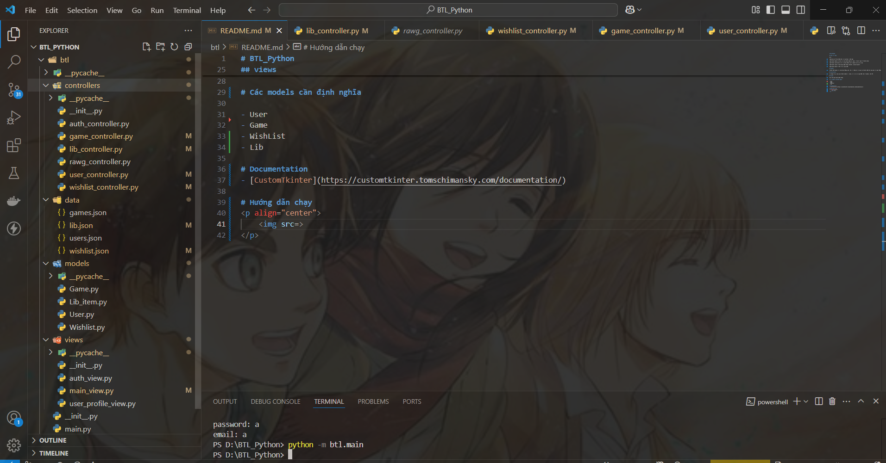

# BTL_Python

## Cấu trúc App

btl/

├── main.py # Điểm khởi đầu của ứng dụng / chạy App

├── Folder models/ # Chứa các class định nghĩa dữ liệu và lấy dữ liệu từ folder datas

├── Folder controllers/ # Xử lý datas được lấy từ models để tải lên view

├── Folder views/ # Giao diện người dùng (tkinter, custom tkinter)

└── Folder datas/ # Lưu trữ dữ liệu JSON

## models

Folder định nghĩa các class đối tượng, get, set, và dùng để làm việc với Folder JSON cho việc ghi các đối tượng vào file JSON

## controllers

có nhiệm vụ kết nối giữa folder models và views, xử lý các dữ liệu được lấy từ models, lấy API

## views

Hiển thị giao diện người dùng

# Các models cần định nghĩa

- User
- Game
- WishList
- Lib

# Documentation
- [CustomTkinter](https://customtkinter.tomschimansky.com/documentation/)

# Hướng dẫn chạy 
<p align="center">
    
</p>

- B1: Tạo 1 folder để lưu
- B2: Vào folder đó và clone về
- B3: Đổi tên folder mới clone về là btl
- B4: Cuối cùng là vào terminal chạy lệnh

```bash
python -m btl.main
```
> Lưu ý: đừng vào thư mục btl nếu không sẽ không chạy được